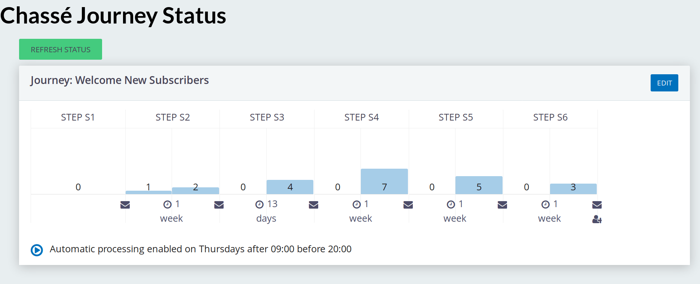

# Monitoring your journeys

This page explains how to see where people are at in your journeys.

## The overview page

Find this at **Mailings » Chassé Supporter Journeys**. Each journey gets a
chart showing the number of contacts at each point in the journey and details
about the steps.

In the screenshot above we can see:

* Nobody is in step S1.

* The little envelope icon between step S1 and step S2 means that when S1 is
  processed contacts on that step will be sent a mailing. You can hover your
  mouse over the icon to see which mailing is sent.

* Step S2 is split into two parts.

* There's 1 contact that is on step S2 but they're still waiting for their
  allocated delay (1 week, shown by the clock icon) before they can be
  processed for S2

* There's 2 contacts in S2 that will progress as soon as that journey is
  processed (again, the envelope icon shows you that they will be sent a
  mailing for that). With automatic processing it would be more typical to see
  contacts in the 'waiting' side since they will be processed almost as soon as
  they are ready.

* At S6 there's a final mailing sent and then the other icon tells you that this
  step involves putting the contact onto the journey's group.

* A sentence explains that automatic processing is enabled. Here you can see
  that contacts are only processed on Thursdays between 9am and 8pm.

* Not shown above, but if a journey does not use automatic processing then you
  will see a button to manually progress the journey. Take care with that!

## On a Contact record

A contact's journey step is stored in a custom dataset that you can see and edit
directly on their record. You'll also see a "not before" date stored: the
contact will not have the step they are on processed until that date and time
have past. Normally that date is calculated based on the configured step delay
on the previous step, but should you need to manually change it, you can.

Because Chassé mailings are done with the normal CiviMail system you can see all
the mailings they have been sent on the **Mailings** tab (if enabled) or
**Activities** tab, and the **Groups** tab shows whether they're in the group
(e.g. after completing a journey); or whether they unsubscribed during a journey
(will be shown as Removed group).

## Advanced search

Because the steps are just a custom field you can use the **Search » Advanced
Search** to search for contacts on a particular step.

## CiviMail reports

Chassé mailings are normal mailings, so all thet normal reports are available.
